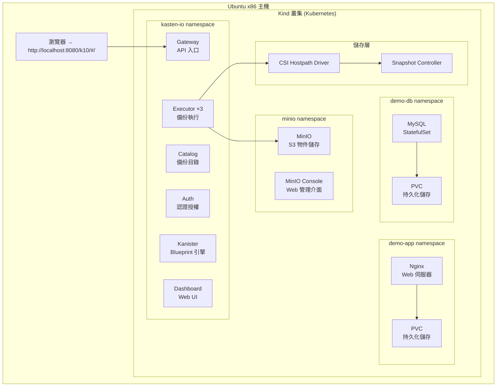
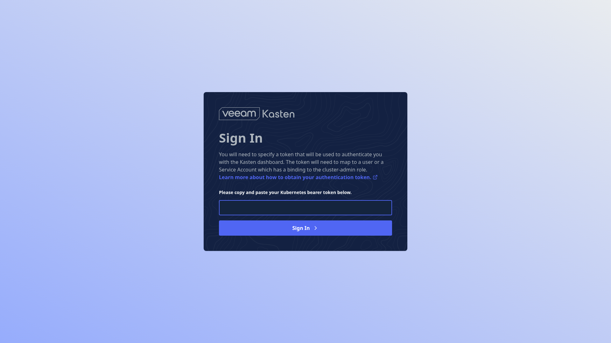
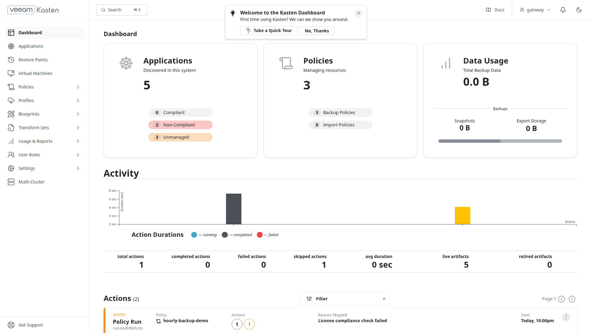
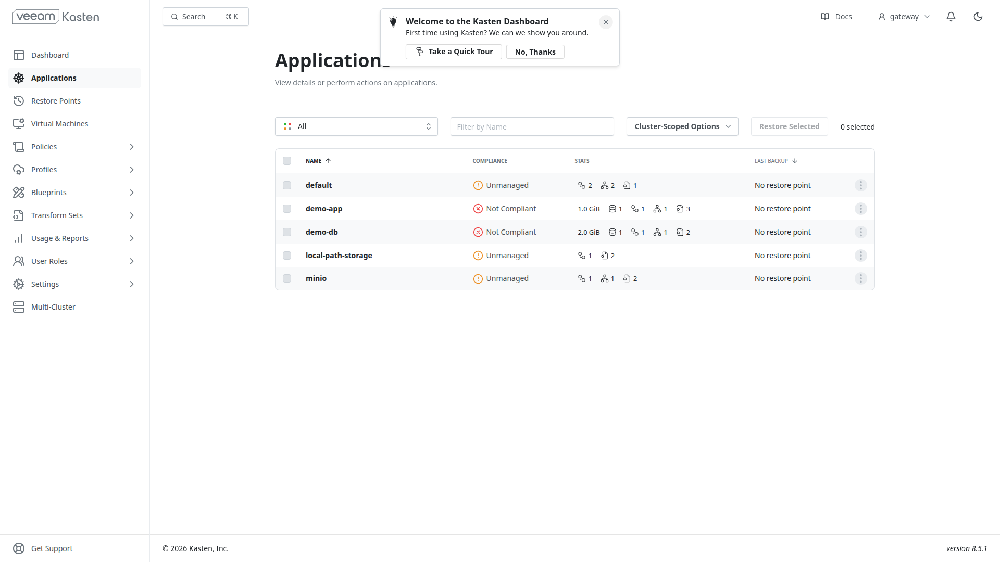
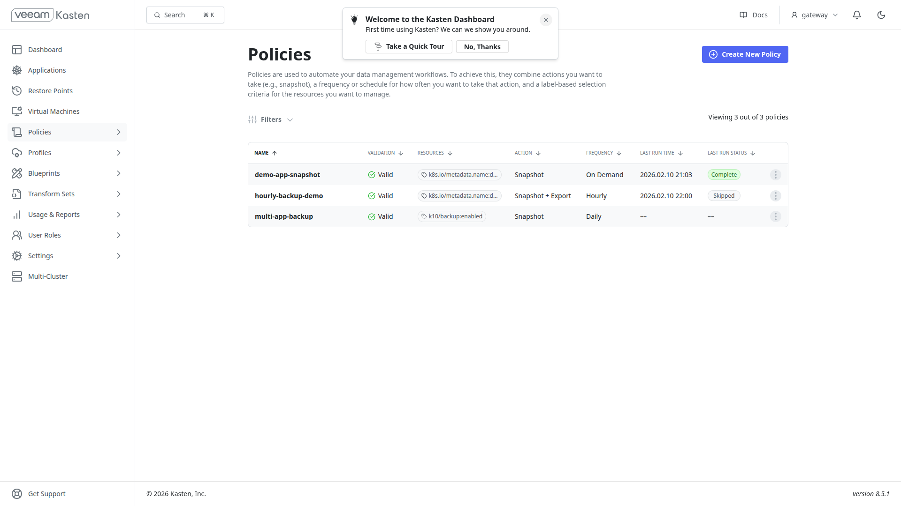
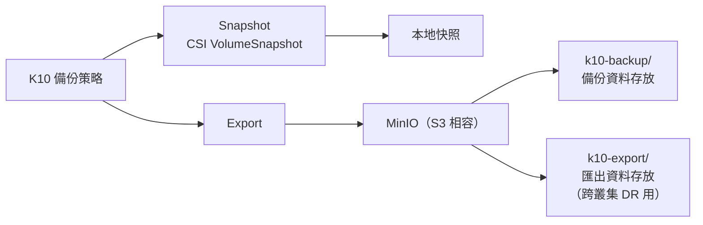
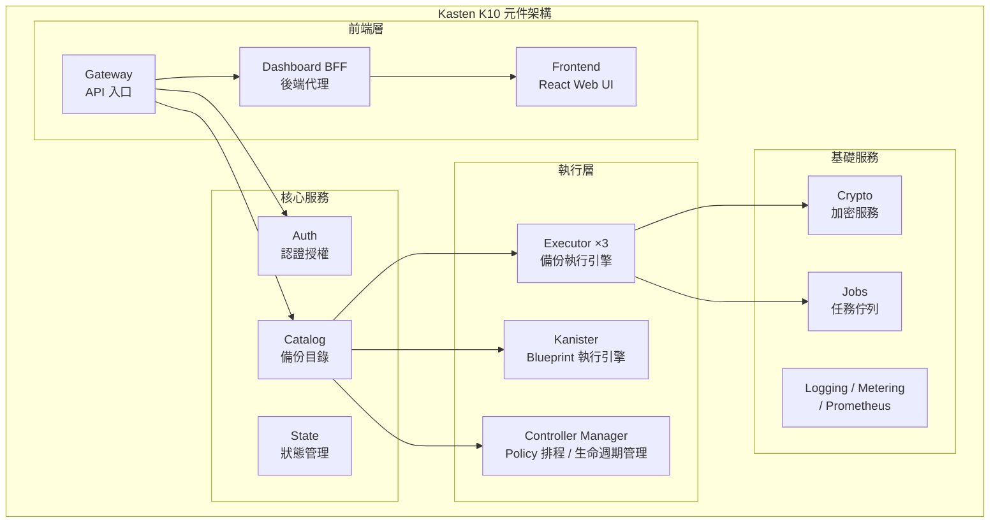
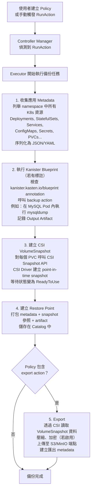
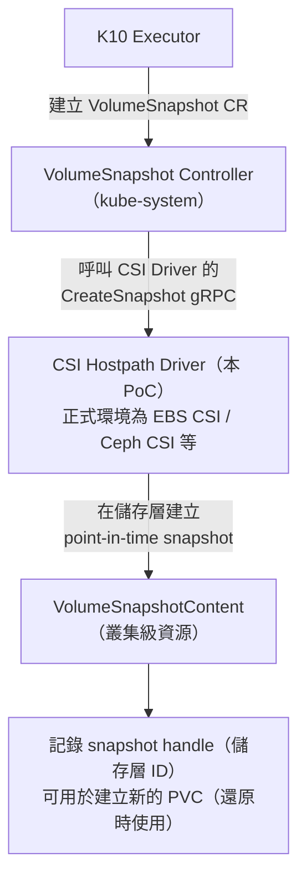
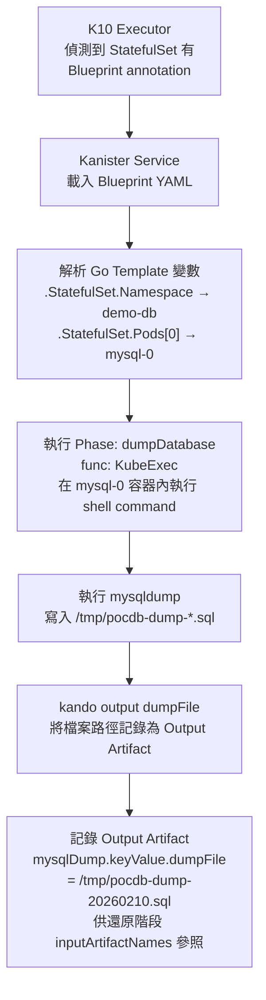

# Kasten K10 備份與還原 PoC — Kind 叢集

在本機 **Kind** 叢集上實作 **Kasten K10**（Veeam 旗下產品）的完整概念驗證（Proof of Concept），使用 **MinIO** 作為 S3 相容物件儲存後端。

## 什麼是 Kasten K10？

Kasten K10 是專為 Kubernetes 打造的企業級備份與災難復原平台。不同於傳統備份工具，K10 理解 Kubernetes 原生概念——namespace、Deployment、StatefulSet、PVC、ConfigMap、Secret——並將它們作為整體「應用程式」進行備份。

**核心功能：**
- **應用自動發現** — 自動偵測叢集中所有工作負載
- **策略式備份** — 支援排程或隨需備份，搭配 GFS（祖父-父-子）保留策略
- **應用感知備份** — 透過 Kanister Blueprint 實現資料庫一致性快照（例如快照前先執行 `mysqldump`）
- **細粒度還原** — 可還原整個 namespace，或僅挑選個別資源（ConfigMap、Secret、PVC）
- **還原時轉換** — 復原時可動態修改 StorageClass、副本數、Annotation 等設定
- **匯出與跨叢集 DR** — 將備份匯出至 S3/MinIO，並在不同叢集匯入還原
- **Web Dashboard** — 完整的圖形化介面，管理策略、監控合規、執行還原
- **RBAC 與多租戶** — 控制誰可以備份/還原哪些應用程式

## 架構總覽



## 環境需求

| 項目 | 最低需求 | 建議配置 |
|------|---------|---------|
| 作業系統 | Ubuntu 22.04+ x86_64 | Ubuntu 24.04 LTS |
| CPU | 4 核心 | 8 核心 |
| 記憶體 | 12 GB | 16 GB |
| 磁碟 | 50 GB | 100 GB SSD |
| Docker | 24.0+ | 27.x+ |
| kubectl | 1.28+ | 1.30+ |
| Helm | 3.12+ | 3.16+ |
| Kind | 0.22+ | 0.24+ |

> K10 會運行 17+ 個 Pod，因此 12 GB 記憶體是實際最低需求。

## 快速開始

完整的逐步操作指南請參閱 [`kasten-k10-poc-kind-ubuntu.md`](kasten-k10-poc-kind-ubuntu.md)，以下為摘要：

### 1. 建立 Kind 叢集

```bash
kind create cluster --config kind-k10-config.yaml --wait 300s
```

### 2. 安裝 VolumeSnapshot 支援

```bash
# 安裝 CRD
kubectl apply -f https://raw.githubusercontent.com/kubernetes-csi/external-snapshotter/v8.2.0/client/config/crd/snapshot.storage.k8s.io_volumesnapshotclasses.yaml
kubectl apply -f https://raw.githubusercontent.com/kubernetes-csi/external-snapshotter/v8.2.0/client/config/crd/snapshot.storage.k8s.io_volumesnapshotcontents.yaml
kubectl apply -f https://raw.githubusercontent.com/kubernetes-csi/external-snapshotter/v8.2.0/client/config/crd/snapshot.storage.k8s.io_volumesnapshots.yaml

# 安裝 Snapshot Controller
kubectl apply -f https://raw.githubusercontent.com/kubernetes-csi/external-snapshotter/v8.2.0/deploy/kubernetes/snapshot-controller/rbac-snapshot-controller.yaml
kubectl apply -f https://raw.githubusercontent.com/kubernetes-csi/external-snapshotter/v8.2.0/deploy/kubernetes/snapshot-controller/setup-snapshot-controller.yaml

# 安裝 CSI Hostpath Driver
git clone https://github.com/kubernetes-csi/csi-driver-host-path.git
cd csi-driver-host-path && ./deploy/kubernetes-latest/deploy.sh && cd ..
```

### 3. 部署 MinIO（S3 後端儲存）

```bash
kubectl apply -f minio-deployment.yaml
```

### 4. 安裝 Kasten K10

```bash
helm repo add kasten https://charts.kasten.io/ && helm repo update
kubectl create namespace kasten-io
helm install k10 kasten/k10 \
  --namespace kasten-io \
  --set auth.tokenAuth.enabled=true \
  --set injectKanisterSidecar.enabled=true \
  --set gateway.service.type=NodePort \
  --set gateway.service.nodePort=30080 \
  --wait --timeout=600s
```

### 5. 部署示範應用程式

```bash
kubectl apply -f demo-nginx-k10.yaml
kubectl apply -f demo-mysql-k10.yaml
```

### 6. 設定 K10

```bash
kubectl apply -f k10-location-profile.yaml   # MinIO 儲存位置設定
kubectl apply -f mysql-blueprint.yaml         # MySQL 應用感知備份 Blueprint
kubectl apply -f snapshot-policy-ondemand.yaml
kubectl apply -f scheduled-policy.yaml
kubectl apply -f multi-app-policy.yaml
kubectl apply -f transform-set.yaml
kubectl apply -f k10-rbac.yaml
```

### 7. 存取 Dashboard

```bash
TOKEN=$(kubectl create token gateway -n kasten-io --duration=24h)
echo "網址: http://localhost:8080/k10/#/"
echo "Token: $TOKEN"
```

在瀏覽器開啟 `http://localhost:8080/k10/#/`，貼上 Token 即可登入。

## Dashboard 畫面截圖

### 登入頁面
輸入 ServiceAccount Token 進行身份驗證：



### 主儀表板
顯示應用程式保護狀態、策略執行統計、資料用量，以及最近的備份活動紀錄：



### 應用程式列表
K10 自動發現叢集中所有 namespace，並顯示合規狀態（Compliant / Non-Compliant / Unmanaged）以及資源統計：



### 備份策略
管理所有備份策略，包含驗證狀態、資源選擇器、排程頻率與最近執行結果：



## 專案檔案說明

| 檔案 | 用途 |
|------|------|
| `kind-k10-config.yaml` | Kind 叢集設定（1 個控制平面 + 2 個 Worker，含 Port Mapping） |
| `minio-deployment.yaml` | MinIO S3 相容物件儲存部署檔 |
| `demo-nginx-k10.yaml` | Nginx 示範應用，含 PVC、ConfigMap、Secret |
| `demo-mysql-k10.yaml` | MySQL StatefulSet 示範應用，含持久化儲存 |
| `k10-location-profile.yaml` | K10 Location Profile，指向 MinIO |
| `mysql-blueprint.yaml` | Kanister Blueprint，用於 MySQL 應用感知備份 |
| `snapshot-policy-ondemand.yaml` | 隨需快照策略 |
| `scheduled-policy.yaml` | 每小時排程備份，含匯出與 GFS 保留策略 |
| `multi-app-policy.yaml` | 基於 Label 的多應用備份策略 |
| `transform-set.yaml` | 還原時轉換規則（縮減副本、變更 StorageClass） |
| `k10-rbac.yaml` | 多租戶存取控制的 RBAC 規則 |
| `kasten-k10-poc-kind-ubuntu.md` | 完整 PoC 操作指南，包含 14 個測試案例 |

## 核心概念

### 策略（Policy）
Policy 定義了**備份什麼**、**何時備份**、**備份到哪裡**。策略可以是排程型（`@hourly`、`@daily`）或隨需型（`@onDemand`），每個策略包含 `backup` 和 `export` 等動作。

### 儲存位置設定檔（Location Profile）
Profile 告訴 K10 將備份資料儲存在哪裡。本 PoC 使用 S3 相容的 MinIO 端點。在正式環境中可以是 AWS S3、Azure Blob、GCS 或 NFS。

### 還原點（Restore Point）
每次成功備份都會建立一個 Restore Point——它是整個應用程式的時間點快照（包含所有 K8s 資源 + Volume 資料）。還原操作即是從這些還原點中復原。

### Kanister Blueprint
Blueprint 定義了應用程式專屬的備份/還原邏輯。例如 MySQL Blueprint 會在拍攝 Volume Snapshot 前先執行 `mysqldump`，確保資料庫的交易一致性。

### 轉換集（TransformSet）
在還原時套用的規則，可修改 K8s 資源——例如將 StorageClass 從 `premium-ssd` 改為 `standard`，或將 Replica 從 3 縮減為 1（用於 DR 環境）。

## PoC 測試案例

| # | 測試案例 | 驗證方式 |
|---|---------|---------|
| 1 | 應用自動發現 | Dashboard：Applications 頁面 |
| 2 | 隨需快照 | CLI：RunAction CRD 或 Dashboard |
| 3 | 排程備份（每小時 + 匯出） | 設定 `@hourly` 頻率的 Policy |
| 4 | 多應用策略 | Label 選擇器：`k10/backup=enabled` |
| 5 | CSI VolumeSnapshot | 驗證 `kubectl get volumesnapshots -A` |
| 6 | 匯出至 S3（MinIO） | 檢查 MinIO bucket 內容 |
| 7 | 完整應用還原 | 刪除 namespace，從 Dashboard 還原 |
| 8 | 細粒度還原 | 僅還原選定的資源 |
| 9 | 還原時轉換 | 套用 TransformSet 修改設定 |
| 10 | Kanister Blueprint（MySQL） | 使用 mysqldump 的應用感知備份 |
| 11 | 跨叢集災難復原 | 在兩個 Kind 叢集間匯出 + 匯入 |
| 12 | RBAC 與多租戶 | 以 ServiceAccount 限定存取範圍 |
| 13 | 合規報告 | Dashboard 合規儀表板 |
| 14 | 授權管理 | Dashboard：Settings > Licenses |

## Velero vs Kasten K10 比較

| 比較項目 | Velero | Kasten K10 |
|---------|--------|------------|
| **授權方式** | Apache 2.0（完全開源） | Starter 免費 / Enterprise 付費 |
| **Web 介面** | 無（僅 CLI） | 完整 Dashboard |
| **應用感知備份** | 需手動撰寫 Hook | Kanister Blueprint 框架 |
| **自動發現** | 無 | 有 |
| **還原時轉換** | 無 | 有 |
| **合規報告** | 無 | 內建 |
| **保留策略** | 僅 TTL | GFS（祖父-父-子） |
| **資源消耗** | 輕量（2-3 個 Pod） | 較重（17+ 個 Pod） |
| **適合對象** | DevOps 團隊、輕量需求 | 企業級、合規導向的組織 |

---

## Kasten K10 的優勢

### 為什麼選擇 Kasten K10？

**1. 真正的 Kubernetes 原生架構**
K10 並非將傳統備份工具移植到 K8s，而是從零開始為 Kubernetes 設計。它透過 CRD（Custom Resource Definition）定義所有操作——Policy、Profile、Blueprint、TransformSet 都是 K8s 原生資源，可以用 `kubectl`、GitOps（ArgoCD/Flux）、或 Helm 管理。

**2. 應用感知備份（Application-Aware Backup）**
傳統備份只複製磁碟區塊，無法保證資料庫一致性。K10 透過 Kanister Blueprint 在快照前執行應用層操作（如 `mysqldump`、`pg_dump`、Oracle RMAN），確保備份的資料是交易一致（transactionally consistent）的。

**3. 完整的 Web Dashboard**
相比 Velero 純 CLI 操作，K10 提供企業級圖形化介面：
- 一鍵備份/還原，降低操作門檻
- 即時合規報告（SLA 達成率、保護覆蓋率）
- 活動紀錄追蹤所有備份/還原操作，便於稽核

**4. 智慧保留策略（GFS Retention）**
支援 Grandfather-Father-Son 保留策略，例如保留 24 個小時備份、7 個每日備份、4 個每週備份、12 個每月備份、5 個年度備份，滿足金融業與合規需求。

**5. 還原時動態轉換（Transform on Restore）**
災難復原時可自動調整配置：
- 變更 StorageClass（例如從 `premium-ssd` 切換到 `standard`）
- 調整 Replica 數量（正式環境 3 副本 → DR 環境 1 副本）
- 修改 Annotation 與 Label

**6. 跨叢集災難復原（Cross-Cluster DR）**
將備份匯出至 S3/MinIO 後，可在完全不同的叢集匯入並還原，實現真正的異地備援。

**7. Starter Edition 免費且功能完整**
Starter Edition 與 Enterprise Edition 功能完全相同，僅限制 Worker Node 數量（30 天後最多 5 個），適合 PoC 與小型環境。

### 適用場景

| 場景 | K10 如何解決 |
|------|-------------|
| 金融業合規稽核 | 合規 Dashboard + 活動紀錄 + GFS 保留策略 |
| 資料庫備份一致性 | Kanister Blueprint（MySQL、PostgreSQL、MongoDB、Oracle） |
| 多租戶環境 | RBAC 控制不同團隊的備份/還原權限 |
| 混合雲 DR | 匯出至 S3/Azure Blob/GCS，跨雲還原 |
| DevOps 自助服務 | 開發者透過 Dashboard 自行還原測試資料 |

---

## MinIO 的優勢

### 為什麼在 PoC 中使用 MinIO？

**1. S3 相容 API**
MinIO 完全相容 AWS S3 API，任何支援 S3 的工具（K10、Velero、Restic、Rclone）都能直接對接，無需修改程式碼。這意味著 PoC 中驗證的配置可以無縫切換到正式的 AWS S3、GCS 或 Azure Blob。

**2. 輕量且易部署**
單一二進位檔即可啟動，在 Kubernetes 中只需一個 Pod。非常適合本地測試與 PoC 環境，不需要雲端帳號或額外費用。

**3. 高效能物件儲存**
MinIO 專為高吞吐量設計，支援：
- 糾刪碼（Erasure Coding）保護資料完整性
- 物件鎖定（Object Locking）防止勒索軟體篡改備份
- 版本控制（Versioning）保留歷史版本

**4. 企業級功能**
- **加密**：支援 SSE-S3 與 SSE-KMS 靜態加密
- **複寫**：支援跨站點複寫（Site Replication）
- **監控**：內建 Prometheus metrics 與 Web Console
- **IAM**：細粒度存取控制策略

**5. 從 PoC 到正式環境的平滑過渡**
- PoC 階段：單節點 MinIO（`emptyDir`），快速驗證
- 測試環境：MinIO + PVC，持久化儲存
- 正式環境：MinIO 分散式叢集或直接切換至 AWS S3

### MinIO 在本 PoC 中的角色



MinIO 在此 PoC 中扮演 **Location Profile** 的後端儲存，K10 將匯出的備份資料以 S3 協定寫入 MinIO bucket，供跨叢集還原或長期保留使用。

---

## K10 技術架構深入解析

### 元件架構

K10 由多個微服務組成，部署在 `kasten-io` namespace 中：



### 各元件職責說明

| 元件 | Pod 名稱 | 職責 |
|------|---------|------|
| **Gateway** | `gateway` | API 入口與反向代理，處理所有外部請求，路由至對應的後端服務 |
| **Auth** | `auth-svc` | 負責 Token 驗證、RBAC 權限檢查、Multi-Tenancy 隔離 |
| **Catalog** | `catalog-svc` | 維護備份目錄（Restore Points、Artifacts 的 metadata），使用內嵌資料庫 |
| **Executor** | `executor-svc` (×3) | 實際執行備份/還原/匯出操作的工作引擎，多副本確保並行處理能力 |
| **Kanister** | `kanister-svc` | Blueprint 執行引擎，負責呼叫應用層的備份/還原邏輯（如 mysqldump） |
| **Controller Manager** | `controllermanager-svc` | 監聽 Policy CRD 變更，按排程觸發 RunAction，管理資源生命週期 |
| **Dashboard BFF** | `dashboardbff-svc` | Backend-for-Frontend 模式，為 React 前端提供聚合 API |
| **Frontend** | `frontend-svc` | React SPA，提供 Web Dashboard 介面 |
| **Crypto** | `crypto-svc` | 處理備份資料的加密/解密，管理加密金鑰 |
| **Jobs** | `jobs-svc` | 任務排隊與調度，追蹤長時間執行的備份/還原任務 |
| **State** | `state-svc` | 內部狀態管理，儲存 K10 運行時的配置與狀態資訊 |
| **Logging** | `logging-svc` | 集中式日誌收集，供 Dashboard Activity 頁面查詢 |
| **Metering** | `metering-svc` | 使用量計量（節點數、備份次數），用於 License 管理 |
| **Prometheus** | `prometheus-server` | 內建監控，收集 K10 各元件的 metrics |
| **Aggregated APIs** | `aggregatedapis-svc` | K8s API Aggregation Layer，讓 K10 的 CRD 可透過 K8s API 存取 |

### 備份流程（技術細節）

一個完整的備份流程如下：



### CRD 資源模型

K10 使用多個 CRD 來管理備份生命週期：

```
config.kio.kasten.io/v1alpha1
├── Policy              ← 定義備份策略（頻率、保留、動作）
├── Profile             ← 定義儲存位置（S3 endpoint、credential）
├── TransformSet        ← 定義還原時的轉換規則
└── BlueprintBinding    ← 綁定 Blueprint 到特定 workload

cr.kanister.io/v1alpha1
└── Blueprint           ← 定義應用感知的備份/還原邏輯

actions.kio.kasten.io/v1alpha1
├── RunAction           ← 觸發 Policy 執行
├── BackupAction        ← 備份操作的執行紀錄
├── RestoreAction       ← 還原操作的執行紀錄
├── ExportAction        ← 匯出操作的執行紀錄
└── ImportAction        ← 匯入操作的執行紀錄

apps.kio.kasten.io/v1alpha1
├── Application         ← K10 自動發現的應用
└── RestorePoint        ← 備份產生的還原點
```

### CSI VolumeSnapshot 運作機制

K10 依賴 CSI（Container Storage Interface）進行 volume-level 快照：



在本 PoC 中使用的 `csi-hostpath-snapclass` 透過 annotation `k10.kasten.io/is-snapshot-class: "true"` 讓 K10 知道應該使用這個 VolumeSnapshotClass。

### Kanister Blueprint 執行機制



### 安全性設計

| 層面 | 機制 |
|------|------|
| **認證** | Token-based Auth（ServiceAccount Token）或 OIDC（正式環境建議） |
| **授權** | K8s RBAC — ClusterRole/Role 控制對 K10 CRD 的存取權限 |
| **傳輸加密** | Gateway 支援 TLS（正式環境應啟用 Ingress + cert-manager） |
| **靜態加密** | 匯出至 S3 時支援 SSE-S3/SSE-KMS 加密 |
| **Secret 管理** | Location Profile 的 credential 儲存為 K8s Secret |
| **多租戶隔離** | 透過 namespace-scoped RBAC 限制使用者只能存取特定應用 |

---

## 清理環境

```bash
# 移除 K10
helm uninstall k10 -n kasten-io
kubectl delete namespace kasten-io

# 移除示範應用
kubectl delete namespace demo-app demo-db minio

# 刪除 Kind 叢集
kind delete cluster --name k10-poc
```

## 授權說明

本 PoC 使用 Kasten K10 **Starter Edition**，免費且功能與 Enterprise 完全相同，僅限制節點數量（30 天後最多 5 個 Worker Node）。詳情請參閱 [Kasten 官方文件](https://docs.kasten.io/)。

---

## 附錄：使用 Playwright 自動化操作 Chrome 擷取截圖

本專案的 Dashboard 截圖是透過 **Playwright** 搭配 headless Chrome 自動擷取的。以下說明如何使用此方法，也可應用於自動化測試或定期截圖報告。

### 什麼是 Playwright？

[Playwright](https://playwright.dev/) 是由 Microsoft 開發的瀏覽器自動化框架，支援 Chromium、Firefox、WebKit 三種引擎。相比傳統的 Puppeteer，Playwright 提供：

- **更穩定的等待機制** — 自動等待元素可見、可點擊，減少 flaky test
- **多瀏覽器支援** — 同一套 API 操作 Chrome、Firefox、Safari
- **更強的選擇器** — 支援 `text=`、`role=`、CSS、XPath 等多種定位方式
- **內建 trace viewer** — 錄製操作過程，方便除錯

### 安裝

```bash
# 安裝 playwright-core（不含瀏覽器，使用系統已安裝的 Chrome）
npm install playwright-core

# 或安裝完整版（會自動下載瀏覽器）
npm install playwright
```

### 截圖腳本範例

本專案使用的截圖腳本 `k10-screenshots.js`：

```javascript
const { chromium } = require('playwright-core');
const fs = require('fs');

const TOKEN = fs.readFileSync('/tmp/k10_token.txt', 'utf8').trim();
const BASE = 'http://localhost:8080/k10/';
const OUT = './screenshots';

(async () => {
  // 啟動 headless Chrome
  const browser = await chromium.launch({
    executablePath: '/usr/bin/google-chrome',  // 使用系統 Chrome
    headless: true,
    args: ['--no-sandbox'],
  });

  const context = await browser.newContext({
    viewport: { width: 1920, height: 1080 }
  });
  const page = await context.newPage();

  // 1. 登入：填入 Token 並送出
  await page.goto(BASE, { waitUntil: 'networkidle' });
  await page.locator('input').first().fill(TOKEN);
  await page.locator('button:has-text("Sign In")').first().click();
  await page.waitForTimeout(8000);

  // 2. 處理 EULA（首次登入需接受授權條款）
  const emailInput = page.locator('input[type="email"]').first();
  if (await emailInput.isVisible({ timeout: 3000 }).catch(() => false)) {
    await emailInput.fill('poc@example.com');
    await page.locator('button:has-text("Accept")').click();
    await page.waitForTimeout(10000);
  }

  // 3. 擷取各頁面截圖
  await page.screenshot({ path: `${OUT}/dashboard.png` });

  await page.goto(`${BASE}#/applications`, { waitUntil: 'networkidle' });
  await page.waitForTimeout(5000);
  await page.screenshot({ path: `${OUT}/applications.png` });

  await page.goto(`${BASE}#/policies`, { waitUntil: 'networkidle' });
  await page.waitForTimeout(5000);
  await page.screenshot({ path: `${OUT}/policies.png` });

  await browser.close();
})();
```

### 執行方式

```bash
# 1. 確保 K10 port-forward 正在運行
kubectl --namespace kasten-io port-forward service/gateway 8080:80 &

# 2. 產生 Token
kubectl create token gateway -n kasten-io --duration=24h > /tmp/k10_token.txt

# 3. 執行截圖腳本
node k10-screenshots.js
```

### 其他瀏覽器自動化工具比較

| 工具 | 語言 | 瀏覽器支援 | 特色 |
|------|------|-----------|------|
| **Playwright** | JS/TS/Python/Java/.NET | Chromium, Firefox, WebKit | 微軟維護、auto-wait、trace viewer |
| **Puppeteer** | JS/TS | Chromium 為主 | Google 維護、與 Chrome DevTools 深度整合 |
| **Selenium** | 多語言 | 所有主流瀏覽器 | 老牌工具、WebDriver 標準、社群龐大 |
| **Cypress** | JS/TS | Chromium, Firefox | 專注 E2E 測試、內建 time-travel 除錯 |

> 本專案選用 **Playwright + playwright-core** 的組合，因為它不需要額外下載瀏覽器（直接使用系統已安裝的 Chrome），且 API 設計對表單互動（填入 Token、點擊按鈕、等待頁面載入）的支援最為穩定。
